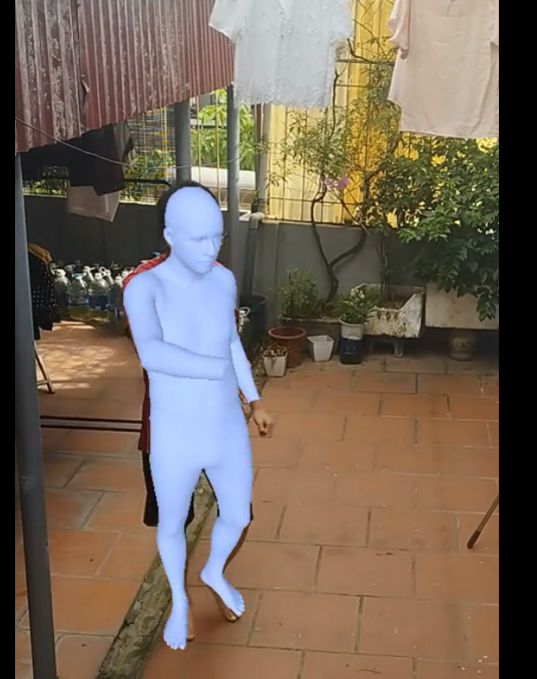
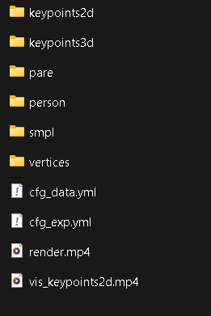

<!--
 * @Date: 2025-08-24
 * @Author: Your Name
 * @Project: Mocap - Monocular Video
 * @FilePath: /Readme.md
-->

<div align="center">
    
</div>

**Mocap - Monocular Video** là một dự án demo dựa trên [EasyMocap](https://github.com/zju3dv/EasyMocap), tập trung vào **3D human motion capture** từ **video monocular (một camera)**.  
Dự án cung cấp pipeline: **extract frames → keypoints2D → pose3D → visualize motion**.


---

## ✨ Tính năng chính
- 🖼️ **Extract Frames**: Trích xuất khung hình từ video.  
<div align="center">
      
  </div>
- 📍 **Keypoints 2D**: Phát hiện keypoints 2D bằng OpenPose / HRNet / MediaPipe.  
<div align="center">
      
  </div>
- 🧍 **Pose Estimation 3D**: Ước lượng tư thế người trong không gian 3D.  
<div align="center">
      
  </div>
- 🎥 **Monocular Mocap Pipeline**: Toàn bộ quy trình từ video → 3D motion.  
<div align="center">
      
  </div>
- 🔎 **Phân tích & tối ưu**:  
  - Lọc keypoints theo confidence score.  
  - Tinh chỉnh pose bằng thuật toán tối ưu.  
  - Giảm nhiễu trong chuyển động khung xương.  

<div align="center">
    
    <br>
    <sup>Ví dụ pipeline monocular video → 3D skeleton</sup>
</div>

---

## ⚡ Cài đặt & Chạy

```bash
# 1. Kiểm tra và cài đặt NVIDIA Driver (nếu cần)
sudo apt update
sudo ubuntu-drivers autoinstall
sudo reboot

# 2. Kiểm tra card NVIDIA
nvidia-smi

# 3. Cài đặt CUDA 12.4
wget https://developer.download.nvidia.com/compute/cuda/12.4.0/local_installers/cuda_12.4.0_550.54.14_linux.run
sudo sh cuda_12.4.0_550.54.14_linux.run

# 4. Thêm CUDA vào PATH
echo 'export PATH=/usr/local/cuda-12.4/bin:$PATH' >> ~/.bashrc
echo 'export LD_LIBRARY_PATH=/usr/local/cuda-12.4/lib64:$LD_LIBRARY_PATH' >> ~/.bashrc
source ~/.bashrc

# 5. Cài đặt cuDNN (cần tải từ NVIDIA Developer website)
# Truy cập: https://developer.nvidia.com/cudnn
# Sau khi tải về:
sudo tar -xvf cudnn-linux-x86_64-8.9.7.29_cuda12-archive.tar.xz
sudo cp cudnn-*-archive/include/cudnn*.h /usr/local/cuda-12.4/include 
sudo cp -P cudnn-*-archive/lib/libcudnn* /usr/local/cuda-12.4/lib64 
sudo chmod a+r /usr/local/cuda-12.4/include/cudnn*.h /usr/local/cuda-12.4/lib64/libcudnn*

# 6. Clone repo EasyMocap
git clone https://github.com/zju3dv/EasyMocap.git
cd EasyMocap

# 7. Tạo môi trường Python
conda create -n easymocap python=3.9 -y
conda activate easymocap

# 8. Cài đặt PyTorch với CUDA 12.4
pip install torch torchvision torchaudio --index-url https://download.pytorch.org/whl/cu124

# 9. Cài đặt các requirements
pip install -r requirements.txt

# 10. Cài đặt thư viện bổ sung
pip install pyrender trimesh git+https://github.com/giucampa/pysmplx
pip install pyopengl pyglet

# 11. Cài đặt detectron2
pip install 'git+https://github.com/facebookresearch/detectron2.git'

# 12. Tải pretrained models
mkdir -p data/smplx
wget https://github.com/zju3dv/EasyMocap/releases/download/v0.01/smplx.zip -O data/smplx/smplx.zip
unzip data/smplx/smplx.zip -d data/smplx/

# 13. Tải SMPL models
mkdir -p data/smpl
wget https://download.is.tue.mpg.de/smplpl/smpl.zip -O data/smpl/smpl.zip
unzip data/smpl/smpl.zip -d data/smpl/

# 14. Tải checkpoint cho YOLOv4 và HRNet
mkdir -p data/models
wget https://github.com/zju3dv/EasyMocap/releases/download/v0.01/yolov4.weights -O data/models/yolov4.weights
wget https://github.com/zju3dv/EasyMocap/releases/download/v0.01/hrnet.pth -O data/models/hrnet.pth

# 15. Extract frames từ video
python apps/preprocess/extract_video.py --input input.mp4 --output output/images

# 16. Detect người trong video
python apps/demo/detect.py --input output/images --output output/detect

# 17. Extract keypoints 2D
python apps/demo/keypoints.py --input output/images --output output/keypoints2d --det output/detect

# 18. Chạy monocular mocap pipeline
python apps/demo/mocap.py --input output/keypoints2d --output output/mocap --body smpl


